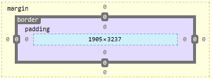

# CSS Height and Width
设置元素的height and width
height:
width:

# 总结
这里总结下学过的几个CSS 样式
元素从内到外:
元素的Color, Background, With/Height, Pading, Element, Border, Margin

盒子模型:
https://www.w3schools.com/css/css_boxmodel.asp

